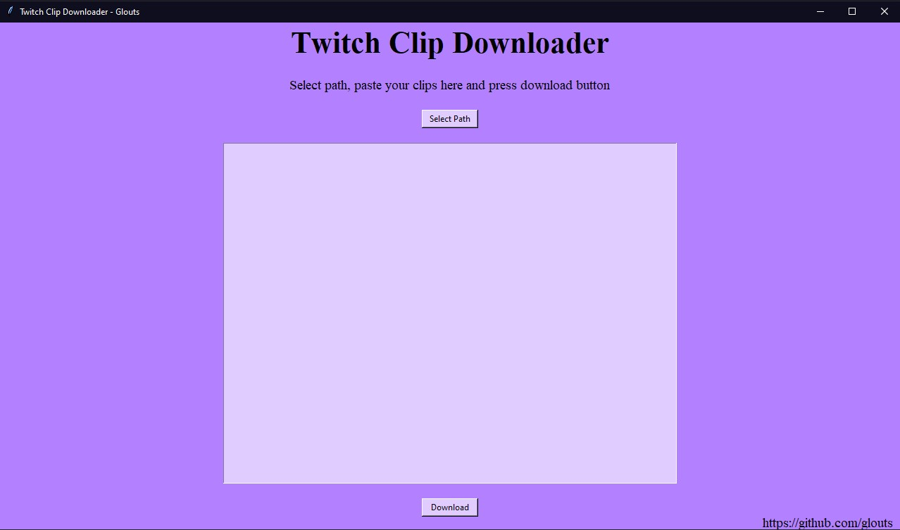

# TwitchClipDownloader

 A project in Python to download a lot of clips from Twitch at once.
 
 

# Prerequisites
* Python3
* pip

# How to install

```
git clone https://github.com/glouts/TwitchClipDownloader.git
cd TwitchClipDownloader
pip install -r requirements.txt
```


# How to use

1. Run `python ClipDownloader.py`
2. Select the path where you want to save the clips.
3. Paste all the clips you want to download in the text box.
4. Click the download button and wait for it.
